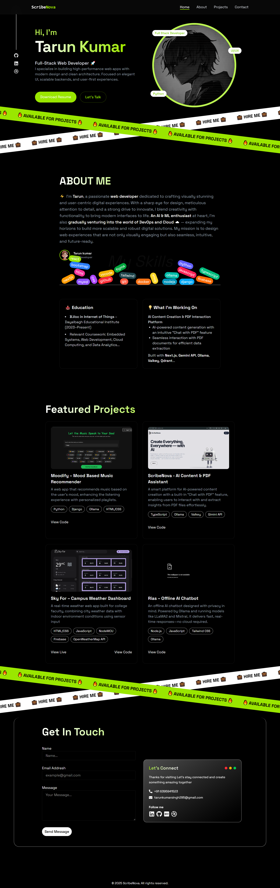

# Personal Portfolio Website

A sleek, modern, and fully responsive developer portfolio built with **React**, **Vite**, **Matter.js**, and **Tailwind CSS**. This project serves as a digital resume to showcase your skills, projects, and contact information — enhanced with physics-based, interactive visuals powered by Matter.js.

[](https://my-portfolio-zeta-ruddy-57.vercel.app/)




## Tech Stack

| Technology     | Description                                |
|----------------|--------------------------------------------|
| React          | Frontend library for building UI           |
| Matter.js      | 2D physics engine for interactive effects  |
| Tailwind CSS   | Utility-first CSS framework                |
| Vite           | Fast build tool and dev server for React   |


## Getting Started

### Prerequisites

- [Node.js](https://nodejs.org/) (v16+ recommended)  
- npm or yarn

### Installation

```bash
# Clone the repository
git clone https://github.com/tarunkumar-sys/my-portfolio.git
cd my-portfolio

# Install dependencies
npm install

# Start development server
npm run dev
````

> The app will be available at `http://localhost:5173` or similar depending on your dev setup.


## Contact

If you'd like to connect or collaborate, feel free to reach out:

* LinkedIn: [linkedin.com/in/tarun-kumar](https://www.linkedin.com/in/tarun-kumar-295-scary-crimson)


## License

Licensed under the [MIT License](./LICENSE). Feel free to use and modify this project for personal or professional use.
